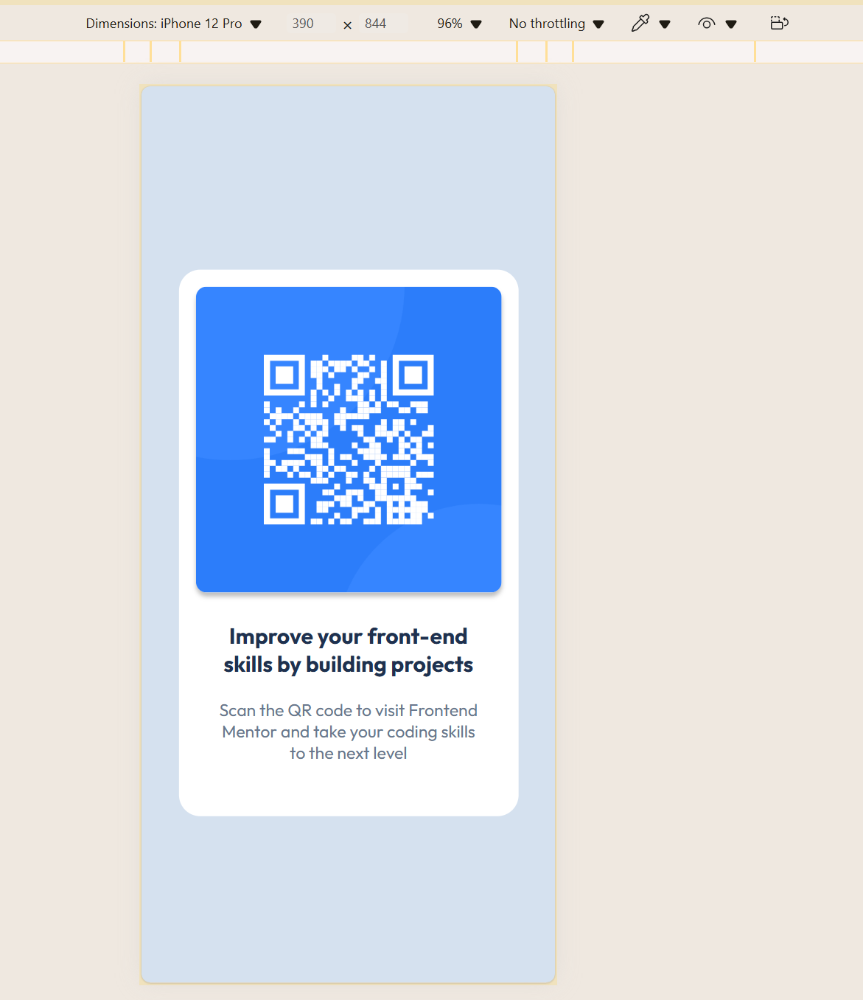

# Frontend Mentor - QR code component solution

This is a solution to the [QR code component challenge on Frontend Mentor](https://www.frontendmentor.io/challenges/qr-code-component-iux_sIO_H). 

## Overview

### Screenshot

### Links

-  Site URL: [qr-code URL](https://grimm-n.github.io/QR-Code-component/)

## My process

### Built with
- Semantic HTML5 markup
- CSS custom properties
- Flexbox

### What I learned
Initially, I considered using absolute positioning to place the QR card. However, I decided to use Flexbox instead for better adaptability and simplicity

### Continued development

In future projects, I want to continue improving my skills with CSS Grid and Flexbox to create more complex and responsive layouts. Additionally, I plan to learn more about JavaScript to add interactive elements to my web pages. I also want to refine my use of CSS animations to make user interfaces more engaging.

Also, I want to focus on optimizing my projects for mobile devices. Currently, I believe this is one of the most important components of modern web development. My goal is to ensure that my websites are fully responsive and provide a seamless user experience across all screen sizes.

### Useful resources

- [A More Modern CSS Reset](https://piccalil.li/blog/a-more-modern-css-reset/) - I found this CSS reset very useful. It helped me start with a clean slate and avoid inconsistencies across different browsers. I plan to use this reset in future projects to ensure a consistent and modern base for my CSS styling.

## Author
- Frontend Mentor - [@Grimm-N](https://www.frontendmentor.io/profile/Grimm-N)

